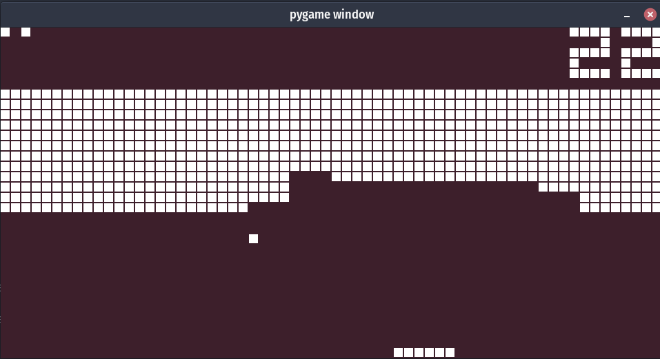
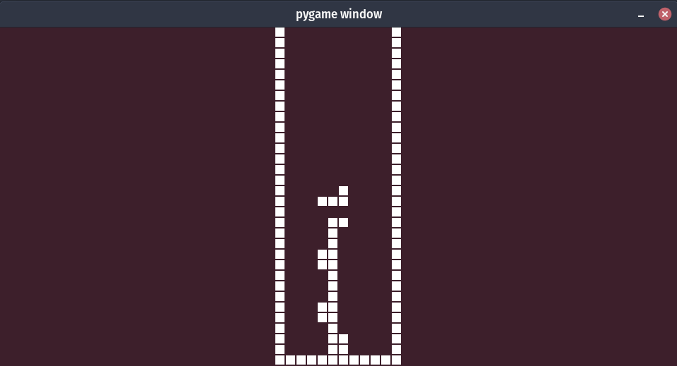
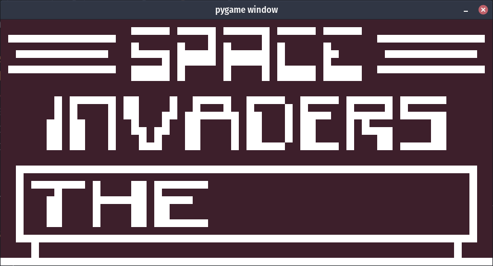
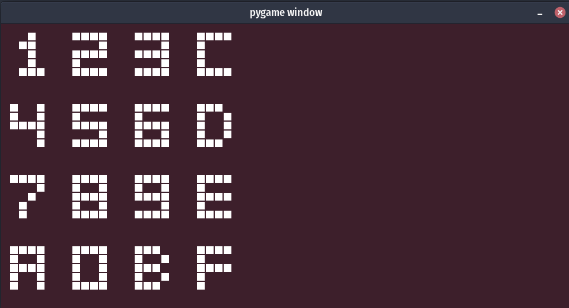
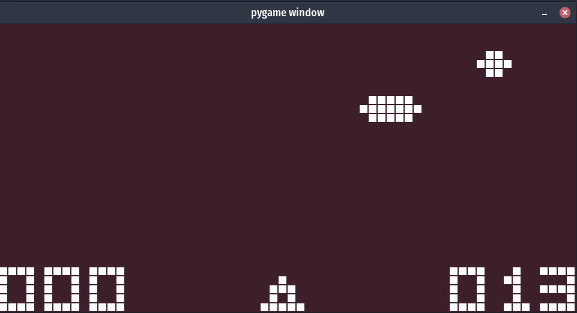
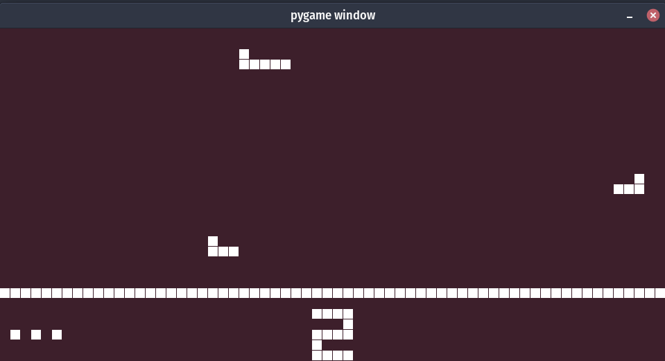
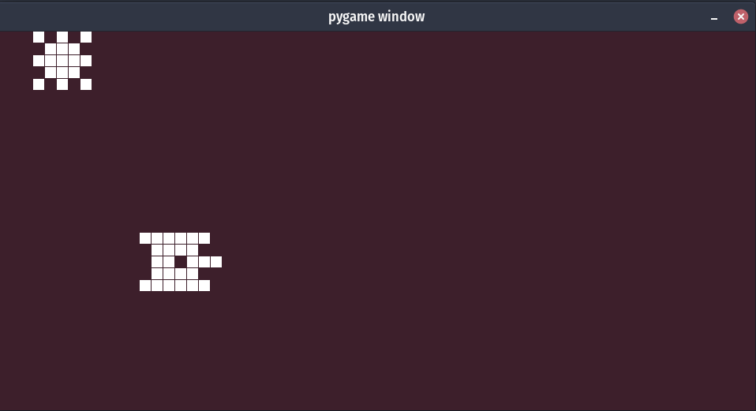

Chip 8 Emualtor with Python and Pygame
-------------
##### Python Version Used : 3.8
##### Libraries Used:
- pygame : Version: 2.0.1

------------
#### Resources and guides :
###### [Chip-8 Technical Reference](http://devernay.free.fr/hacks/chip8/C8TECH10.HTM)  
###### [How to write an emulator](https://multigesture.net/articles/how-to-write-an-emulator-chip-8-interpreter/)  
##### [Mastering CHIP‐8](https://github.com/mattmikolay/chip-8/wiki/Mastering-CHIP%E2%80%908)

###### I used this project do debug my own : [Python-CHIP8-Emulator](https://github.com/AlpacaMax/Python-CHIP8-Emulator)  

-------------  

### How to run:
- In the prject directory type:
  `python3 app.py games/maze.ch8`
- To change the game, instead of `games/maze.ch8` just write any other game in games directory, e.g `python3 app.py games/wall.ch8`
- To change the colors (colors in RGB), speed or size of screen :
  change these variables in `chip8/constants.py`:
  
  - `BACKGROUND_COLOR = (61, 31, 43)`
  - `ACTIVE_COLOR = (255, 255, 255)`
  - `SCREEN_SCALE = 15`
  - `CLOCK_SPEED = 500`
- The control keys are:
  1,2,3,4
  Q,W,E,R
  A,S,D,F
  Z,X,C,V

- To Change it ,change the `my_keyboard_keys` in `chip8/keys.py`,
  then run `python3 app.py games/keypad_test.ch8` to make sure it's working.

-------------  

## Screenshots  

   
  
   
  
  
  
  

